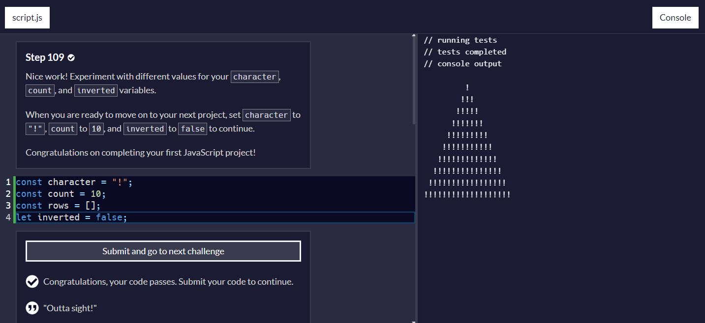

# Pyramid Generator

## Description

This repository contains a simple JavaScript project that generates a pyramid shape using a specified character. The project is part of the freeCodeCamp curriculum, specifically the challenge "Learn Introductory JavaScript by building a Pyramid Generator." The goal of this project is to practice basic JavaScript skills, including loops, functions, and string manipulation.

## Code Explanation

The code provided generates a pyramid of a specified character (`character`), with a specified number of rows (`count`). Additionally, the pyramid can be inverted based on the `inverted` boolean flag.

### Variables

- `character`: The character used to build the pyramid. In this case, it's set to `"!"`.
- `count`: The number of rows in the pyramid. For this example, it's set to `10`.
- `rows`: An array to store each row of the pyramid.
- `inverted`: A boolean flag to determine if the pyramid should be inverted. It's initially set to `false`.

### Functions

#### padRow

```javascript
function padRow(rowNumber, rowCount) {
  return " ".repeat(rowCount - rowNumber) + character.repeat(2 * rowNumber - 1) + " ".repeat(rowCount - rowNumber);
}
```

- **Parameters**:
  - `rowNumber`: The current row number being processed.
  - `rowCount`: The total number of rows in the pyramid.

- **Returns**: A string representing a single row of the pyramid, with the appropriate padding of spaces to center the characters.

This function calculates the necessary padding and characters for each row to ensure the pyramid is centered. It uses `String.prototype.repeat()` to generate the necessary spaces and characters.

### Main Logic

#### Generating Rows

```javascript
for (let i = 1; i <= count; i++) {
  if (inverted) {
    rows.unshift(padRow(i, count));
  } else {
    rows.push(padRow(i, count));
  }
}
```

- This loop runs from `1` to `count` (inclusive) and generates each row of the pyramid using the `padRow` function.
- Depending on the value of `inverted`, rows are either added to the beginning (`unshift`) or the end (`push`) of the `rows` array.

#### Creating the Result String

```javascript
let result = ""

for (const row of rows) {
  result = result + "\n" + row;
}
```

- This loop concatenates each row from the `rows` array into a single string (`result`), with each row separated by a newline character (`\n`).

#### Output

```javascript
console.log(result);
```

- Finally, the `result` string is printed to the console, displaying the pyramid.

## Usage

To run the pyramid generator, simply execute the JavaScript code in an environment that supports JavaScript (such as Node.js or a web browser console). Modify the `character`, `count`, and `inverted` variables as needed to generate different pyramids.

## Example Output

With `character` set to `"!"`, `count` set to `10`, and `inverted` set to `false`, the output will be:

```
         !
        !!!
       !!!!!
      !!!!!!!
     !!!!!!!!
    !!!!!!!!!!
   !!!!!!!!!!!!
  !!!!!!!!!!!!!!
 !!!!!!!!!!!!!!!!
!!!!!!!!!!!!!!!!!!
```

If `inverted` is set to `true`, the pyramid will be upside down.

## Screenshot

Here's a screenshot of the pyramid generator in action:



## Contribution

Feel free to fork this repository and make improvements. Pull requests are welcome!
